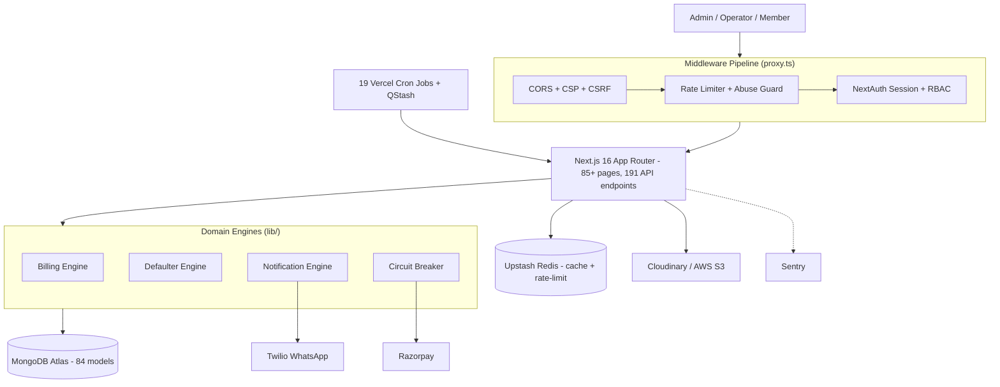

<div align="center">

# AquaSync

**Multi-Tenant SaaS Platform for Facility & Business Management**

[](https://modern-businesses-management.vercel.app/)


<p>
  <a href="#system-architecture">Architecture</a> ·
  <a href="#engineering-highlights">Engineering Highlights</a> ·
  <a href="#design-decisions">Design Decisions</a> ·
  <a href="#testing--qa">Testing</a> ·
  <a href="#getting-started">Getting Started</a>
</p>
</div>

---

AquaSync is a production-grade, multi-tenant SaaS platform built to automate operations for swimming pools, hostels, and small businesses. It features an idempotent billing engine, automated WhatsApp notifications, role-based access control, and a 9-stage CI/CD pipeline. 

Designed and developed solo over 4.5 months to demonstrate end-to-end software engineering capabilities—from data modeling and resilient payment integrations to load testing and automated deployment.

## System Architecture



## Engineering Highlights

- **Idempotent Billing Engine**: Monthly billing checks a `LedgerCycle` record before executing. Uses atomic, cycle-guarded `updateOne` operations to guarantee members are never double-charged, even under overlapping cron job executions.
- **Smart Circuit Breaker (`opossum`)**: Custom transient-error classifier intercepts Razorpay webhooks and API calls. Only 5xx and network failures trip the breaker, preventing system-wide payment lockouts due to 4xx client errors.
- **Automated Defaulter State Machine**: Overdue payments map through a pure status function (`active → warning → blocked`) with configurable grace windows, applied system-wide nightly via cron.
- **Dead-Letter Queue (DLQ)**: Failed webhook deliveries and async background jobs are captured in `WebhookDLQ` and `FailedJob` collections for automatic/manual replay.
- **Multi-Tenant Identity Layer**: A single `UnifiedUser` read-model allows querying any entity (pool member, hostel resident, business customer) by phone number across tenants in a single query.
- **Production Guardrails**: Database seed endpoints are hard-disabled outside development. Load-testing bypasses require explicit environment flags, secret headers, and IP allowlist matches.

## Design Decisions

- **Idempotency in Billing**: Billing requires strict consistency. Without idempotency, overlapping cron executions or manual retries could double-charge members. A `LedgerCycle` document acts as a lock, ensuring exactly-once processing per billing cycle.
- **Circuit Breaker on Payments**: Razorpay webhooks and API calls are external dependencies. The `opossum` circuit breaker prevents cascading failures; if the payment gateway experiences downtime, the system fails fast rather than tying up connections, protecting the rest of the application.
- **Upstash Redis for Caching & Limits**: Redis was chosen over in-memory caching to support horizontal scaling on serverless (Vercel). It provides consistent rate limiting and abuse prevention across stateless edge functions.
- **Decoupled Cron Jobs**: Background tasks (billing, reminders, DB cleanup) are separated into 19 independent cron jobs rather than a single monolithic worker. This isolates failures and allows individual timeout and retry configurations per task.
- **Data Model (Multi-Tenancy)**: Data isolation is achieved at the application level via an `Organization` reference on all documents rather than physical database splitting. This keeps the schema manageable while allowing a unified `SuperAdmin` plane to oversee all tenants.

## Testing & QA (9-Stage CI/CD)

Every push to `main` or `develop` triggers a full [CI pipeline](.github/workflows/ci.yml) running against real MongoDB and Redis instances (no mocking).

`Lint & Typecheck` → `Production Build` → `Schema Validation` → `API Tests` → `Security Tests` → `Integration Tests` → `Code Coverage` → `E2E Tests` → `Performance Smoke Test`

| Testing Layer | Scope & Tooling |
|---|---|
| **Unit & API** | Vitest across 13 suites covering pool, members, hostel, payments, auth, edge cases, and RBAC. |
| **Integration** | Dedicated specs for external services (MongoDB, Redis, S3, Twilio, Razorpay). |
| **Security** | Custom middleware test suites and a dedicated **OWASP Top 10** validation spec. |
| **End-to-End** | Playwright across Chromium, Firefox, and WebKit on mobile, tablet, and desktop breakpoints. |
| **Performance** | k6 load, spike, and chaos tests + 100-request health-check smoke test on every build. |

## Core Infrastructure

| Layer | Technologies |
|---|---|
| **Framework** | Next.js 16 (App Router, Server Components), React 19, Tailwind CSS 4 |
| **Database & Caching** | MongoDB Atlas (Mongoose 9, 84 models), Upstash Redis |
| **Job Queues** | Upstash QStash, Vercel Cron (19 scheduled jobs) |
| **Auth & Security** | NextAuth.js, JWT (`jose`), bcryptjs, Zod validation |
| **Payments** | Razorpay (Orders, Webhooks, Refunds) |
| **Messaging** | Twilio (WhatsApp), Nodemailer |
| **Observability** | Sentry, Pino (structured logging), prom-client, Vercel Analytics |

## Project Metrics

- **191** REST API Endpoints
- **84** MongoDB Models
- **60+** Automated Test Suites
- **19** Scheduled Background Jobs

## Features by Vertical

### Pool & Facility Management
- QR-code membership cards with integrated camera scanning for entry validation.
- Real-time occupancy tracking with configurable safety-limit alerts.
- Membership lifecycle management (registration, plans, renewals, blacklisting).

### Hostel Management (ERP)
- Visual room, floor, and block allocation.
- Automated rent-cycle engine handling advance payments and recurring monthly billing.
- Daily occupancy-sync cron jobs to maintain vacancy accuracy.

### Core Business Suite
- Multi-admin access with strict per-business data isolation.
- Real-time inventory and stock tracking with low-stock signals.
- Custom in-house ad campaign engine for platform monetization (scheduling, delivery strategies, CTR analytics).

## Getting Started

```bash
# 1. Clone & install
git clone https://github.com/Manthan-13521/Mordern-Buisness-Management.git
cd Mordern-Buisness-Management
npm install

# 2. Configure environment variables (.env.local)
cp .env.example .env.local

# 3. Seed database (Local development only)
curl -X POST -H "Authorization: Bearer $SEED_SECRET" http://localhost:3000/api/seed

# 4. Start development server
npm run dev
```

## License

All Rights Reserved. © 2026 Manthan Jaiswal.
This repository is shared as a technical portfolio piece. AquaSync is an actively developed commercial product. Please reach out before reusing, forking for redistribution, or deploying a derivative in production.
