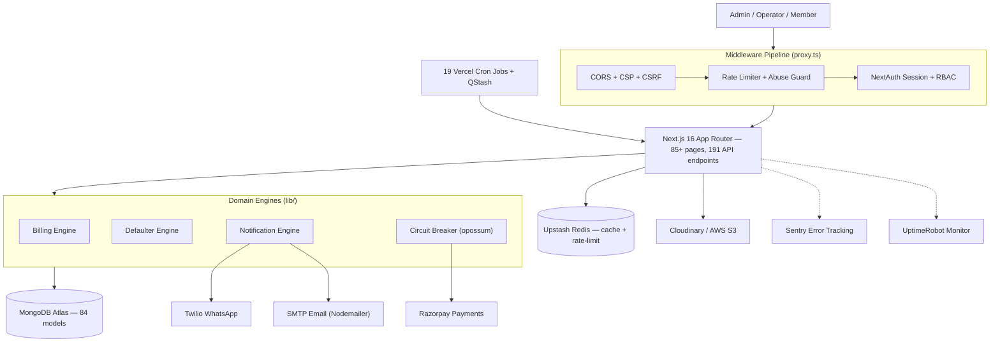

<div align="center">


<h1>
  
  &nbsp;AquaSync
</h1>

<p><strong>Production-Grade Multi-Tenant SaaS Platform for Facility &amp; Business Management</strong></p>

<p>
  <a href="https://modern-businesses-management.vercel.app/" target="_blank">
    
  </a>
</p>

<p>
  
  
  
  
</p>

<p>
  
  
  
  
</p>

<br/>

<p>
  <a href="#-system-architecture">Architecture</a> ·
  <a href="#-engineering-highlights">Engineering</a> ·
  <a href="#-cloud-infrastructure">Infrastructure</a> ·
  <a href="#-testing--cicd">Testing</a> ·
  <a href="#-getting-started">Getting Started</a>
</p>

</div>

---

AquaSync is a production-grade, multi-tenant SaaS platform built to automate operations for **swimming pools**, **hostels**, and **small businesses**. It features an idempotent billing engine, automated WhatsApp notifications, role-based access control, and a 9-stage CI/CD pipeline — designed and built solo over 4.5 months.

---

## 🏗 System Architecture



---

## ☁️ Cloud Infrastructure

<div align="center">

<table>
  <thead>
    <tr>
      <th>Service</th>
      <th>Provider</th>
      <th>Role</th>
    </tr>
  </thead>
  <tbody>
    <tr>
      <td></td>
      <td><strong>Vercel</strong></td>
      <td>Hosting, edge functions, 19 cron jobs, CI/CD integration</td>
    </tr>
    <tr>
      <td></td>
      <td><strong>Razorpay</strong></td>
      <td>Orders, webhooks, refunds — wrapped in a circuit breaker</td>
    </tr>
    <tr>
      <td></td>
      <td><strong>Upstash Redis</strong></td>
      <td>Distributed caching, rate limiting, QStash job queues</td>
    </tr>
    <tr>
      <td></td>
      <td><strong>Twilio</strong></td>
      <td>WhatsApp notifications — payment alerts, expiry reminders</td>
    </tr>
    <tr>
      <td></td>
      <td><strong>SMTP / Nodemailer</strong></td>
      <td>Transactional emails — invoices, OTPs, onboarding</td>
    </tr>
    <tr>
      <td></td>
      <td><strong>Cloudinary</strong></td>
      <td>Image uploads — member photos, QR codes, assets</td>
    </tr>
    <tr>
      <td></td>
      <td><strong>Amazon AWS S3</strong></td>
      <td>Secure file storage — exports, backups, documents</td>
    </tr>
    <tr>
      <td></td>
      <td><strong>Sentry</strong></td>
      <td>Real-time error tracking, performance monitoring</td>
    </tr>
    <tr>
      <td></td>
      <td><strong>UptimeRobot</strong></td>
      <td>24/7 uptime monitoring with instant alerts</td>
    </tr>
    <tr>
      <td></td>
      <td><strong>MongoDB Atlas</strong></td>
      <td>84 Mongoose models, multi-tenant data isolation</td>
    </tr>
  </tbody>
</table>

</div>

---

## ⚡ Engineering Highlights

<table>
  <tr>
    <td width="50%">
      <h3>🔐 Idempotent Billing Engine</h3>
      <p>Monthly billing checks a <code>LedgerCycle</code> record before executing. Uses atomic, cycle-guarded <code>updateOne</code> operations to guarantee members are never double-charged, even under overlapping cron job executions.</p>
    </td>
    <td width="50%">
      <h3>⚡ Smart Circuit Breaker</h3>
      <p>Custom transient-error classifier (<code>opossum</code>) intercepts Razorpay webhooks. Only 5xx and network failures trip the breaker — preventing system-wide lockouts from 4xx client errors.</p>
    </td>
  </tr>
  <tr>
    <td>
      <h3>🔄 Defaulter State Machine</h3>
      <p>Overdue payments map through a pure status function (<code>active → warning → blocked</code>) with configurable grace windows, applied nightly via cron across all tenants.</p>
    </td>
    <td>
      <h3>📬 Dead-Letter Queue (DLQ)</h3>
      <p>Failed webhook deliveries and async background jobs are captured in <code>WebhookDLQ</code> and <code>FailedJob</code> collections for automatic or manual replay.</p>
    </td>
  </tr>
  <tr>
    <td>
      <h3>👤 Multi-Tenant Identity Layer</h3>
      <p>A single <code>UnifiedUser</code> read-model allows querying any entity (pool member, hostel resident, business customer) by phone number across tenants in a single query.</p>
    </td>
    <td>
      <h3>🛡 Production Guardrails</h3>
      <p>Database seed endpoints are hard-disabled outside development. Load-test bypasses require explicit environment flags, secret headers, and IP allowlist matches.</p>
    </td>
  </tr>
</table>

---

## 🧠 Design Decisions

<details>
<summary><strong>💳 Why idempotency in billing?</strong></summary>
<br/>
Billing requires strict consistency. Without idempotency, overlapping cron executions or manual retries could double-charge members. A <code>LedgerCycle</code> document acts as a distributed lock, ensuring exactly-once processing per billing cycle per tenant.
</details>

<details>
<summary><strong>🔌 Why a circuit breaker on payments?</strong></summary>
<br/>
Razorpay webhooks and API calls are external dependencies that can fail. The <code>opossum</code> circuit breaker prevents cascading failures — if the payment gateway experiences downtime, the system fails fast rather than tying up connections, protecting the rest of the application.
</details>

<details>
<summary><strong>🟢 Why Upstash Redis over in-memory caching?</strong></summary>
<br/>
Redis was chosen to support horizontal scaling on serverless (Vercel). In-memory caches are not shared across stateless edge function instances. Upstash provides consistent rate limiting and abuse prevention globally.
</details>

<details>
<summary><strong>🕐 Why 19 separate cron jobs instead of one worker?</strong></summary>
<br/>
Background tasks (billing, reminders, DB cleanup) are isolated into 19 independent cron jobs. This isolates failures — a broken reminder job doesn't affect billing — and allows individual timeout, retry, and scheduling configurations per task.
</details>

<details>
<summary><strong>🏢 Why application-level multi-tenancy?</strong></summary>
<br/>
Data isolation is achieved via an <code>Organization</code> reference on all documents rather than physical database splitting. This keeps the schema manageable while allowing a unified SuperAdmin plane to oversee all tenants.
</details>

---

## 🧪 Testing & CI/CD

> Every push to `main` or `develop` triggers a full 9-stage CI pipeline running against **real** MongoDB and Redis instances — no mocking.

```
Lint & Typecheck → Production Build → Schema Validation → API Tests
→ Security Tests → Integration Tests → Code Coverage → E2E Tests → Performance Smoke Test
```

<div align="center">

| Testing Layer | Scope & Tooling |
|:---|:---|
| **Unit & API** | Vitest — 13 suites covering pool, members, hostel, payments, auth, edge cases, and RBAC |
| **Integration** | Dedicated specs for MongoDB, Redis, AWS S3, Twilio, Razorpay |
| **Security** | Custom middleware suites + dedicated **OWASP Top 10** validation spec |
| **End-to-End** | Playwright across Chromium, Firefox, WebKit on mobile, tablet, and desktop |
| **Performance** | k6 load, spike, and chaos tests + 100-request health-check smoke on every build |

</div>

---

## 📦 Core Stack

<div align="center">

| Layer | Technologies |
|:---|:---|
| **Framework** | Next.js 16 (App Router, Server Components), React 19, TypeScript 5 |
| **Database** | MongoDB Atlas, Mongoose 9 (84 models), Upstash Redis |
| **Job Queues** | Upstash QStash, Vercel Cron (19 scheduled jobs) |
| **Auth & Security** | NextAuth.js, JWT (`jose`), bcryptjs, Zod validation |
| **Payments** | Razorpay (Orders, Webhooks, Refunds, Circuit Breaker) |
| **Messaging** | Twilio WhatsApp API, Nodemailer SMTP |
| **Media & Storage** | Cloudinary, Amazon AWS S3 |
| **Observability** | Sentry, Pino (structured logging), prom-client, Vercel Analytics |
| **Monitoring** | UptimeRobot (24/7 uptime), Vercel Speed Insights |

</div>

---

## 📊 Project Metrics

<div align="center">

<table>
  <tr>
    <td align="center"><h2>191</h2><sub>REST API Endpoints</sub></td>
    <td align="center"><h2>84</h2><sub>MongoDB Models</sub></td>
    <td align="center"><h2>19</h2><sub>Scheduled Cron Jobs</sub></td>
    <td align="center"><h2>60+</h2><sub>Automated Test Suites</sub></td>
    <td align="center"><h2>9</h2><sub>CI/CD Pipeline Stages</sub></td>
  </tr>
</table>

</div>

---

## 🌐 Features by Vertical

<details open>
<summary><strong>🏊 Pool & Facility Management</strong></summary>

- QR-code membership cards with integrated camera scanning for entry validation
- Real-time occupancy tracking with configurable safety-limit alerts
- Membership lifecycle management — registration, plans, renewals, blacklisting
- Voice alert system for expired session announcements
- WhatsApp-based expiry reminders and payment follow-ups

</details>

<details>
<summary><strong>🏠 Hostel Management (ERP)</strong></summary>

- Visual room, floor, and block allocation with occupancy map
- Automated rent-cycle engine handling advance payments and recurring monthly billing
- Daily occupancy-sync cron jobs to maintain vacancy accuracy
- WhatsApp rent reminders with defaulter state machine escalation

</details>

<details>
<summary><strong>💼 Core Business Suite</strong></summary>

- Multi-admin access with strict per-business data isolation
- Real-time inventory and stock tracking with low-stock signals
- Digital customer ledger with credit/debit balance management
- Custom in-house ad campaign engine (scheduling, delivery, CTR analytics)
- Labour attendance tracking with shift management

</details>

---

## 🚀 Getting Started

```bash
# 1. Clone & install
git clone https://github.com/Manthan-13521/Mordern-Buisness-Management.git
cd Mordern-Buisness-Management
npm install

# 2. Configure environment variables
cp .env.example .env.local
# Fill in: MongoDB URI, Upstash Redis URL, Razorpay keys, Twilio SID,
#          AWS credentials, Cloudinary config, Sentry DSN, SMTP settings

# 3. Start development server
npm run dev

# 4. Run tests
npm run test          # Unit + API tests
npm run test:e2e      # Playwright E2E
```

> **Note:** The database seed endpoint (`/api/seed`) is disabled outside `NODE_ENV=development` as a production guardrail.

---

## 📄 License

<div align="center">

**All Rights Reserved © 2026 Manthan Jaiswal**

This repository is shared as a technical portfolio piece. AquaSync is an actively developed commercial product.  
Please reach out before reusing, forking for redistribution, or deploying a derivative in production.

<br/>


</div>
